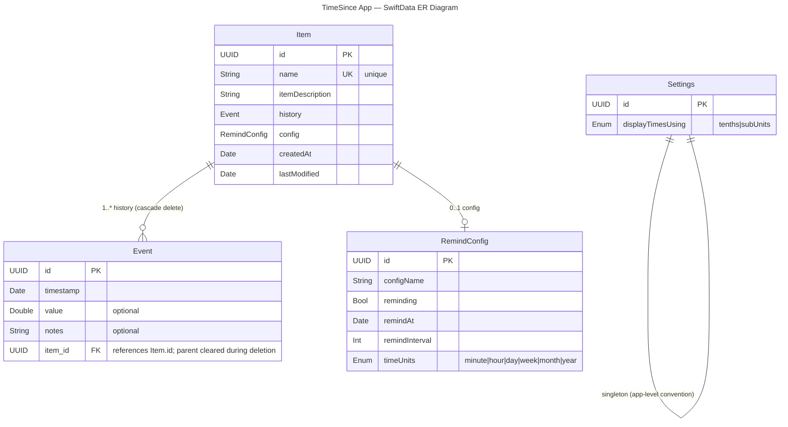

# TimeSince App — ER Diagram
Open with MarkChart for viewing

```mermaid
---
title: TimeSince App — SwiftData ER Diagram
---
erDiagram
    %% Entities
    Item {
        UUID id PK
        String name UK "unique"
        String itemDescription
        Event history
        RemindConfig config
        Date createdAt
        Date lastModified
    }

    Event {
        UUID id PK
        Date timestamp
        Double value "optional"
        String notes "optional"
        UUID item_id FK "references Item.id; parent cleared during deletion"
    }

    RemindConfig {
        UUID id PK
        String configName
        Bool reminding
        Date remindAt
        Int remindInterval
        Enum timeUnits "minute|hour|day|week|month|year"
    }

    Settings {
        UUID id PK
        Enum displayTimesUsing "tenths|subUnits"
    }

    %% Relationships with explicit cardinalities
    %% Item to Event: An Item has many Events; cascade delete from Item -> Event
    Item ||--o{ Event : "1..* history (cascade delete)"

    %% Item to RemindConfig: An Item has at most one RemindConfig (0..1)
    Item ||--o| RemindConfig : "0..1 config"

    %% Settings is a singleton-like model (app-level convention)
    %% Represented as self-relationship note to indicate single active row
    Settings ||--|| Settings : "singleton (app-level convention)"

    %% Additional Notes (as comments)
    %% - Item.name is unique (@Attribute(.unique))
    %% - Item.history inverse is Event.item; deleteRule: .cascade
    %% - Event.item is optional to allow SwiftData to clear the parent during deletion
    %% - RemindConfig.timeUnits uses Units enum: minute|hour|day|week|month|year
    %% - Settings.displayTimesUsing uses DisplayTimesUsing enum: tenths|subUnits

```
lete
