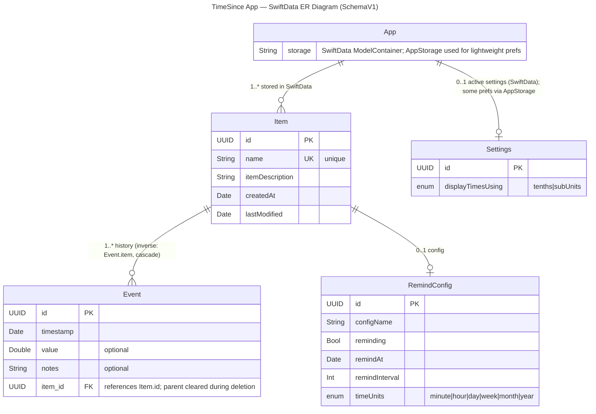

# TimeSince

A SwiftUI app using SwiftData to track items and the time since events, with optional reminders. This repository documents the storage model, schema evolution, and architecture so future migrations are intentional and well-tested.

## Platforms & Requirements
- iOS 18+ (SwiftUI, SwiftData)
- Xcode 26+
- Swift 6.2+

## Architecture Overview
- **UI**: SwiftUI views with state driven by observable models.
- **Data**: SwiftData `ModelContainer` for persisted entities; lightweight preferences via `@AppStorage`.
- **Models**: `Item`, `Event`, `RemindConfig`, `Settings` (see Schema V1 below).
- **Reminders**: App-level configuration to schedule reminders from `RemindConfig`.
- **Testing**: Unit and snapshot-style tests planned; schema verification covered by fixtures.

## Models & Storage
- Storage uses SwiftData with a single `ModelContainer`.
- Lightweight preferences use `AppStorage` for non-relational flags and UI choices.
- Entities:
  - `Item`: unique name, description, timestamps; 1..* relationship to `Event`; optional 0..1 `RemindConfig`.
  - `Event`: timestamped entries associated to an `Item` (optional back-reference to allow parent clearing on delete), optional value/notes.
  - `RemindConfig`: enables reminders for an item with interval and unit.
  - `Settings`: global display settings for times.

## Schema Versioning
We keep schema versions under `docs/Schema` as V1, V2, ... Each version contains:
- A locked Mermaid ER diagram derived from model source code.
- A PNG snapshot exported from the Mermaid diagram (for quick viewing in GitHub).
- Notes about delete rules, uniqueness, and optionality.
- Migration plan from the previous version.

Authoritative source of truth is the model code. Diagrams and PNGs are artifacts generated from code.

Current version: **SchemaV1**.

See: `docs/Schema/SchemaV1.md` for the pinned diagram and notes.

# TimeSince App — ER Diagram
Open with MarkChart for viewing

## Current Schema (SchemaV1)
The diagram below mirrors the current SwiftData models. The Mermaid source is embedded so it can be rendered by GitHub or tools like MarkChart.

