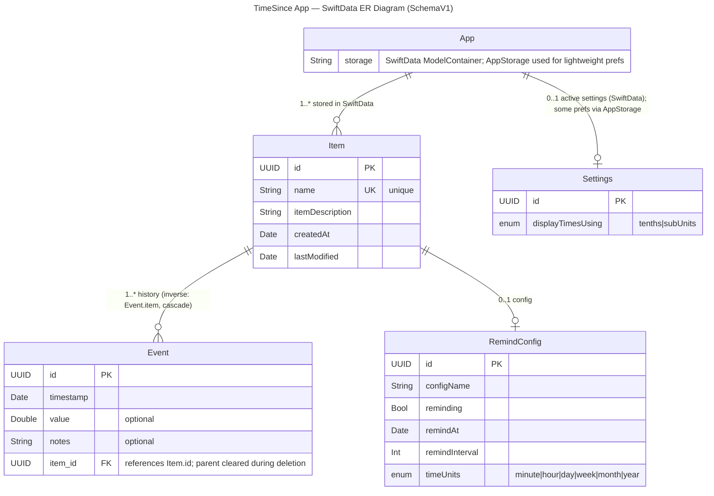

# SchemaV1

This document pins the initial schema. 
The Mermaid diagram and PNG are artifacts derived from the SwiftData model code.

- Mermaid ER diagram (embedded below)
- PNG snapshot: see `Models/TimeSinceERDiagram_SchemaV1` (ensure it is exported from this diagram)

